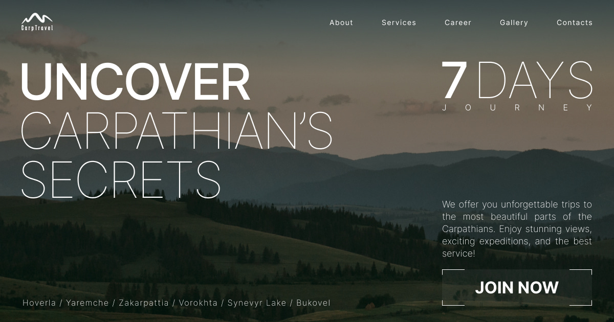

# CarpTravel

CarpTravel is a sleek, modern landing page designed for travel enthusiasts. It showcases various travel services, career opportunities, a stunning gallery, and a smooth contact experience. This project is built with cutting-edge technologies to provide a seamless and engaging user experience.



## Table of Contents

- [Demo](#demo)
- [Features](#features)
- [Getting Started](#getting-started)
  - [Installation](#installation)
  - [Usage](#usage)
- [Technologies](#technologies)
- [Contributing](#contributing)
- [License](#license)

## Demo

Check out the live demo of [CarpTravel](https://carp-travel-bonny-art.vercel.app/) project.

## Features

- **Responsive Design**: Fully responsive from mobile to desktop with a mobile-first approach.
- **Smooth Navigation**: Implements smooth scrolling for easy navigation between sections.
- **Hero Section**: A captivating hero section with a call-to-action button.
- **Dynamic Services Section**: A swiper-based slider with dynamic background images and engaging effects.
- **Career Form Validation**: Utilizes `react-hook-form` and `yup` for form validation.
- **Interactive Gallery**: Infinite slider with draggable functionality and responsive display.
- **Contact Form**: Validated contact form with styled error messages.

## Getting Started

### Installation

To get a local copy up and running, follow these simple steps:

1. Clone the repository:
   ```bash
   git clone https://github.com/bonny-art/carp-travel.git
   ```
2. Navigate to the project directory:
   ```bash
   cd carp-travel
   ```
3. Install dependencies:
   ```bash
   npm install
   ```

### Usage

1. To start the development server, run:

   ```bash
   npm run dev
   ```

   Open your browser. The application will be available at [http://localhost:3000](http://localhost:3000). You can start exploring the app from there.

2. Build the project for production:

   ```bash
   npm run build
   ```

3. Start the production server:
   ```bash
   npm start
   ```

## Technologies

CarpTravel leverages the power of the following technologies:

- **Next.js**: A powerful React framework for server-side rendering and static site generation.
- **Tailwind CSS**: A utility-first CSS framework for rapidly building custom designs.
- **TypeScript**: A statically typed superset of JavaScript that enhances code quality and maintainability.
- **Vercel**: Deployment platform for hosting and managing the project.
- **React Scroll**: Library for smooth scrolling navigation.
- **Swiper**: A powerful slider library for creating modern touch sliders with hardware-accelerated transitions.
- **React Hook Form**: Library for form validation and handling.
- **Yup**: Schema builder for validation.

## Contributing

Contributions are what make the open-source community such an amazing place to learn, inspire, and create. Any contributions you make are **greatly appreciated**.

1. Fork the project.
2. Create your feature branch (`git checkout -b feature/AmazingFeature`).
3. Commit your changes (`git commit -m 'Add some AmazingFeature`).
4. Push to the branch (`git push origin feature/AmazingFeature`).
5. Open a pull request.

## License

This project is distributed under the MIT License.
